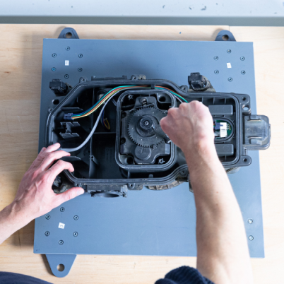
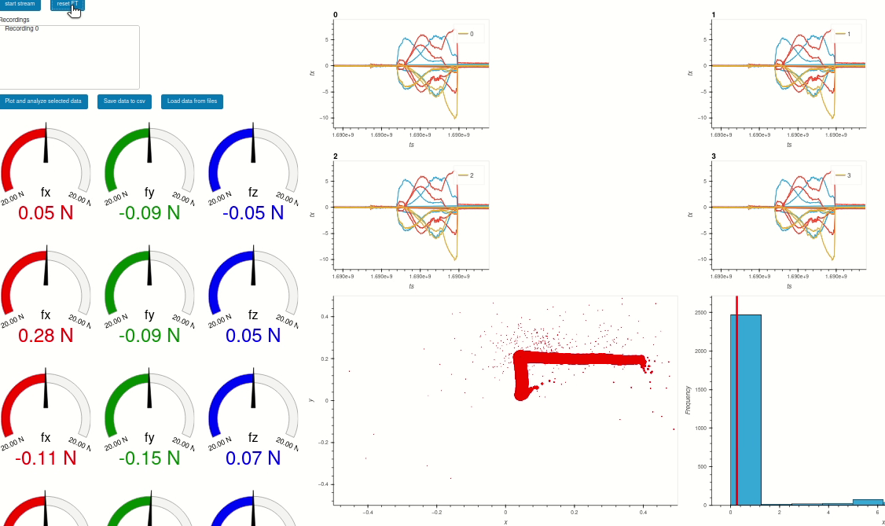

# teach_tool_test

This project holds code to reproduce a force-plate for recording force data of assembly processes.

# BOM:

- 4 x (ATI 80 x20)[https://www.ati-ia.com/products/ft/ft_models.aspx?id=Axia80-M8]
- 4 x Small Plates (step_files/foot.STEP)
- 1 x Bigger Plate (step_files/plate.STEP) 

# Start Mockup Ft Sensor
Driver:
`roslaunch teach_tool test.launch sim:=True`
Mockup Test GUI:
`rosrun teach_tool mockup_test_gui.py`

Run Webgui:
`rosrun teacH_tool webgui.py`

It should look like this

Then open `localhost` or your local ip

# Start with real Sensors
`roslaunch teach_tool_test test.launch sim:=False`

## Install the rust library via PDM

* `pdm run maturin --develop` makes development target available in venv
* `pdm run maturin build -r --manylinux off`
* install with `cd target/wheels && pip install rust_subscriber....py`

